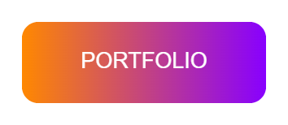

## 🚀 About Me

- Senior Full Engineer with 7+ years of experience in software development
- Technical Lead and Mentor
- Advocate for clean code, collaboration, and impactful solutions

---

## 📫 Contact

- **Email:** benhmidasafoine@gmail.com
- **Location:** Tunisia
- [LinkedIn](https://linkedin.com/in/safoine-benhmida) 

---
Check out my personal portfolio and online CV at:

Source codes at: [Portfolio](https://github.com/safoine27/my-portfolio) | [CV](https://github.com/safoine27/cv) 

## 🛠️ Skills & Expertise

<!-- Frontend -->

<!-- Backend -->

<!-- DevOps -->

<!-- Testing -->

 

---

## 💼 Experience

- **Senior Software Development Engineer** – Think-it GmbH (Dec 2020 - Jun 2025)

- **Full Stack Engineer** – Hala Systems (Aug 2022 - Jan 2024)

- **Web Engineer** – SoundCloud (Feb 2021 - Jul 2022)

- **Full Stack Engineer** – Prodexo (Oct 2017 - Nov 2020)

---

**Certifications**
- **AWS Certified Cloud Practitioner** – Amazon Web Services, Jan 2023

---

## 📢 Let's Connect!

Ready to collaborate or discuss exciting opportunities? [Contact me](mailto:benhmidasafoine@gmail.com) or reach out on [LinkedIn](https://linkedin.com/in/safoine-benhmida) 
